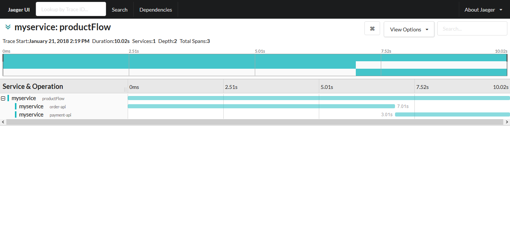

## Pre-Requisite


* Python 2.7
* Linux Distribution

## Starting the Jaeger

```
docker run -d -e COLLECTOR_ZIPKIN_HTTP_PORT=9411 -p5775:5775/udp -p6831:6831/udp -p6832:6832/udp -p5778:5778 -p16686:16686 -p14268:14268 -p9411:9411 jaegertracing/all-in-one:latest
```

## Setup Virtual Environment

```
# pip install virtualenv
$ virtualenv venv
$ cd venv/bin
$ source activate
```

## Install Python dependencies

```
(venv)$ pip install -r requirements.txt
```

## Starting the Order Service

```
(venv)$ export FLASK_APP=orderservice.py
(venv)$ flask run --host=0.0.0.0 --port 7000
```

## Start the Payment Service

```
(venv)$ export FLASK_APP=paymentservice.py
(venv)$ flask run --host=0.0.0.0 --port 6000
```

## Starting the MyService

```
(venv)$ export FLASK_APP=myservice.py
(venv)$ export PAYMENT_URL=http://localhost:6000
(venv)$ export ORDER_URL=http://localhost:7000
(venv)$ flask run --host=0.0.0.0
```

## Output


